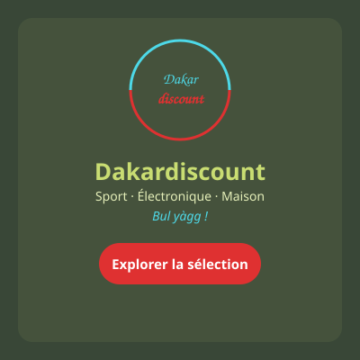

# Marketing Campaign Result — Dakardiscount

## Brand Kit
See [brand-kit.md](brand-kit.md) — now grounded in the real Pomelli-generated brand book (user-supplied PDF), not inferred from site text.

## Campaign Visual

## Ad Copy
See [campaign-copy.md](campaign-copy.md)

## Correction Log
The first pass (text-only `WebFetch` analysis) guessed a red/navy/amber "discount urgency" palette and a generic marketplace positioning. The real brand book showed an olive/pistachio/moss + red + gray palette, a specific sector (sports/electronics/household appliances), and a "Professional, Dynamic, Passionate, Accessible" tone. All three output files were regenerated against the real book — see the provenance table in [brand-kit.md](brand-kit.md#provenance-note--was-the-earlier-inference-close).
